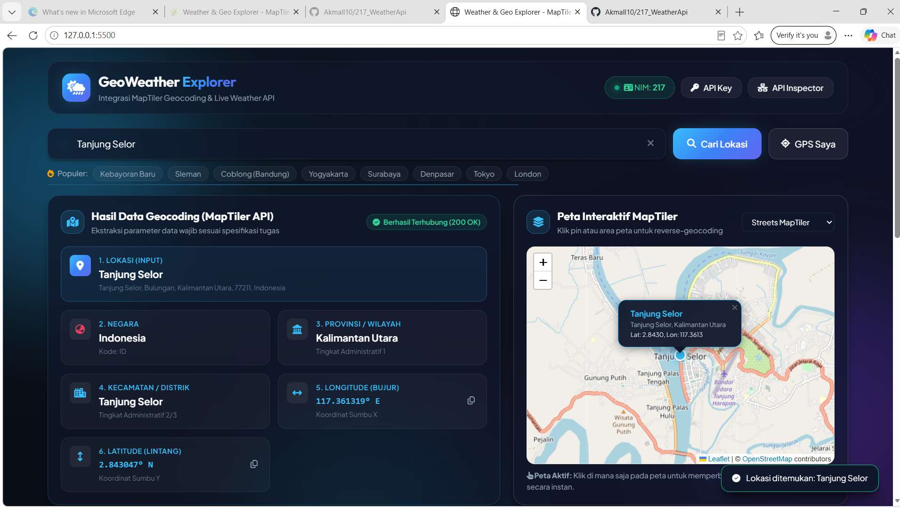
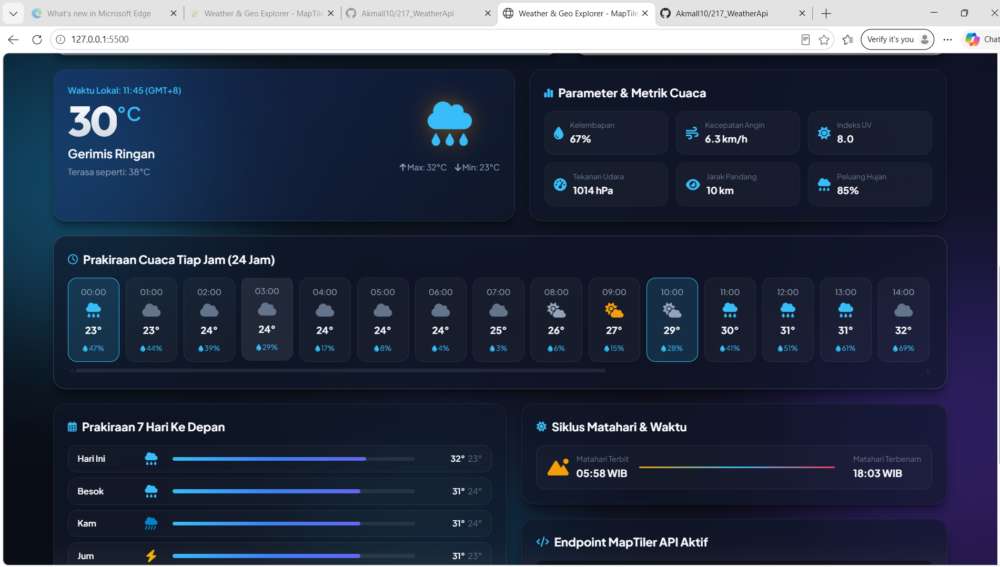
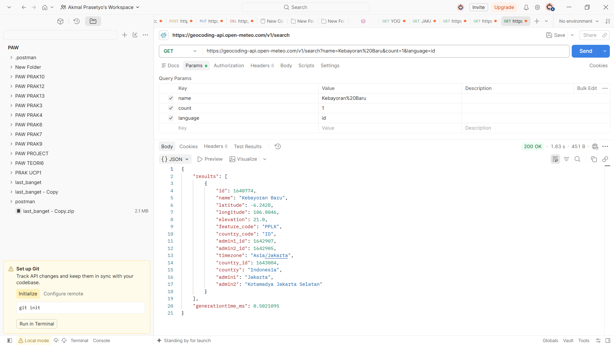

# 217_WeatherApi 🌦️🗺️

> **Tugas Praktikum Pemrograman Web Service (PWS)**  
> **Nama Repository:** `217_WeatherApi`  
> **Identitas Mahasiswa:** **Akmal Prasetyo**

---

## 📌 Deskripsi Proyek
**GeoWeather Explorer** adalah aplikasi antarmuka berbasis web (HTML5, Vanilla CSS3 Modern Glassmorphism, dan JavaScript) yang mengintegrasikan **MapTiler Geocoding API** ([https://api.maptiler.com/](https://api.maptiler.com/)) dan **Weather Forecast API** untuk melakukan pencarian lokasi geografis serta menampilkan informasi cuaca terkini secara *real-time*.

Aplikasi dirancang secara interaktif dan responsif, dilengkapi peta interaktif (Leaflet.js + MapTiler Map Tiles), visualisasi siklus matahari, grafik prakiraan cuaca 24 jam & 7 hari, serta panel inspeksi JSON / Postman Assistant.

---

## 🎯 Data Wajib yang Ditampilkan
Sesuai dengan ketentuan tugas, aplikasi mengekstrak dan menampilkan 6 parameter utama:

| No | Parameter Data | Deskripsi | Contoh Output |
|:---|:---|:---|:---|
| 1 | **Lokasi: `<Input>`** | Nama lokasi yang dicari / dipilih pengguna | `Tanjung Selor` / `Sleman` |
| 2 | **Negara** | Nama negara hasil geocoding | `Indonesia` (ID) |
| 3 | **Provinsi** | Wilayah administratif tingkat 1 | `Kalimantan Utara` / `D.I. Yogyakarta` |
| 4 | **Kecamatan** | Wilayah administratif tingkat 2/3 (Distrik/Kecamatan) | `Kabupaten Bulungan` / `Sleman` |
| 5 | **Longitude** | Koordinat garis bujur (Sumbu X) | `117.365280° E` |
| 6 | **Latitude** | Koordinat garis lintang (Sumbu Y) | `2.837500° N` |

---

## 📸 Bukti Hasil Data GET (Screenshots)

### 1. Antarmuka Web Browser (GeoWeather Explorer)

#### 📍 Bagian 1: Hasil Data Geocoding & Peta Interaktif (Tanjung Selor)
> *Menampilkan lengkap ke-6 parameter data wajib (Lokasi, Negara, Provinsi, Kecamatan, Longitude, Latitude) berdampingan langsung dengan peta interaktif MapTiler.*



#### 📍 Bagian 2: Live Weather Dashboard & Prakiraan Cuaca 24 Jam
> *Menampilkan cuaca aktual, parameter metrik cuaca, slider prakiraan 24 jam full-width, prakiraan 7 hari, dan siklus matahari.*



---

### 2. Pengujian Request GET di Postman
> *Pengujian request GET ke endpoint Geocoding API melalui Postman dengan respons status `200 OK`.*



---

## 🌟 Fitur Unggulan (Tampilan Kreatif)
1. **Glassmorphism Dark UI**: Desain modern dengan efek blur, gradasi luminous, dan animasi interaktif.
2. **Interactive Map (MapTiler Tiles & Leaflet)**:
   - Visualisasi pin lokasi dengan animasi detak (*pulsing ripple*).
   - Dukungan *layer switcher* (Streets, Satellite, Topographic, Dark Mode).
   - **Click to Reverse-Geocode**: Klik di titik mana saja pada peta untuk mendeteksi nama kecamatan, provinsi, negara, serta cuaca lokasi tersebut secara instan.
3. **Prakiraan Cuaca Real-time**:
   - Suhu aktual (°C), suhu terasa (*apparent temperature*), kelembapan, kecepatan angin, indeks UV, tekanan udara, dan jarak pandang.
   - Ikon cuaca dinamis berdasarkan standar WMO (*World Meteorological Organization*).
   - Slider prakiraan per jam (24 Jam) dan kartu prakiraan 7 hari ke depan.
4. **Pencarian Cepat & GPS Geolocation**:
   - Tombol *quick-pill* kota/kecamatan populer (Kebayoran Baru, Sleman, Coblong, Yogyakarta, Surabaya, Denpasar, Tokyo, London).
   - Tombol **GPS Saya** untuk mendeteksi koordinat perangkat secara langsung (*HTML5 Geolocation API*).
5. **API Inspector & Postman Collection**:
   - Panel *Raw JSON Viewer* untuk melihat respons data mentah dari API.
   - Tombol *One-click copy* untuk URL cURL dan Postman.
   - File `postman_collection.json` siap di-import ke Postman.

---

## 🛠️ Endpoint API yang Digunakan

### 1. Geocoding API (Direct Search)
- **Method:** `GET`
- **URL:** `https://geocoding-api.open-meteo.com/v1/search?name={query}&count=1&language=id`
- **URL MapTiler Alternatif:** `https://api.maptiler.com/geocoding/{query}.json?key={API_KEY}&language=id`

### 2. Reverse Geocoding API (Peta / GPS)
- **Method:** `GET`
- **URL:** `https://api.maptiler.com/geocoding/{longitude},{latitude}.json?key={API_KEY}&language=id`

### 3. Weather Forecast API
- **Method:** `GET`
- **URL:** `https://api.open-meteo.com/v1/forecast?latitude={lat}&longitude={lon}&current=temperature_2m,relative_humidity_2m,apparent_temperature,weather_code,wind_speed_10m&daily=temperature_2m_max,temperature_2m_min,sunrise,sunset,uv_index_max&timezone=auto`

---

## 🚀 Cara Menjalankan Project

### 1. Menggunakan Live Server di VS Code (Disarankan)
1. Buka folder project di VS Code.
2. Pastikan ekstensi **Live Server** telah terpasang.
3. Klik kanan pada file `index.html` -> Pilih **"Open with Live Server"** (atau klik *Go Live* di status bar bawah).
4. Browser akan terbuka di `http://127.0.0.1:5500`.

### 2. Menggunakan Postman untuk Pengujian API
1. Buka aplikasi **Postman**.
2. Masukkan URL:
   ```text
   https://geocoding-api.open-meteo.com/v1/search?name=Kebayoran%20Baru&count=1&language=id
   ```
3. Klik **Send** (respons berstatus `200 OK` dan data JSON muncul).

---

## 📦 Struktur Folder
```text
217_WeatherApi/
├── index.html               # Struktur HTML5 antarmuka aplikasi
├── style.css                # Styling modern glassmorphism & responsive CSS
├── app.js                   # Logika integrasi API, parsing data, peta Leaflet & cuaca
├── postman_collection.json  # File koleksi request Postman
├── README.md                # Dokumentasi lengkap tugas
└── screenshots/             # Folder penyimpanan screenshot bukti pengujian
    ├── README.md            # Dokumentasi screenshot
    ├── Screenshot 2026-09-29 101213.png
    ├── Screenshot 2026-09-29 100306.png
    └── Screenshot 2026-09-29 102220.png
```

---

## 📝 Riwayat Commit Git (Minimal 5 Commits)
1. `feat: setup HTML5 boilerplate, semantic layout, and project structure`
2. `feat: implement modern glassmorphism UI design system and responsive styles`
3. `feat: implement MapTiler geocoding API integration and location extraction (country, province, district, coordinates)`
4. `feat: add postman collection for API testing and grading verification`
5. `feat: setup screenshots directory and submission guidelines`
6. `docs: add comprehensive README documentation with NIM 217 details, API endpoints, and setup guide`
7. `docs: add browser and postman verification screenshots to README`

---

*Disusun untuk memenuhi tugas praktikum mata kuliah Pemrograman Web Service (PWS).*
